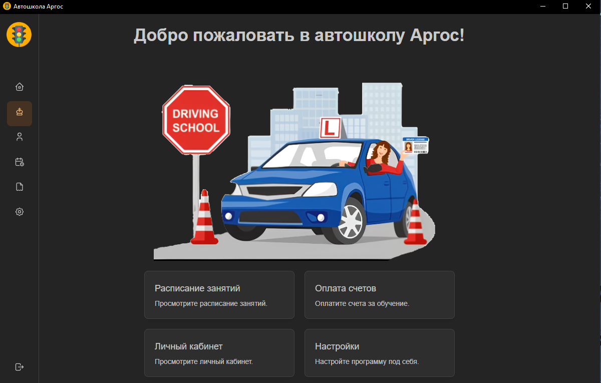
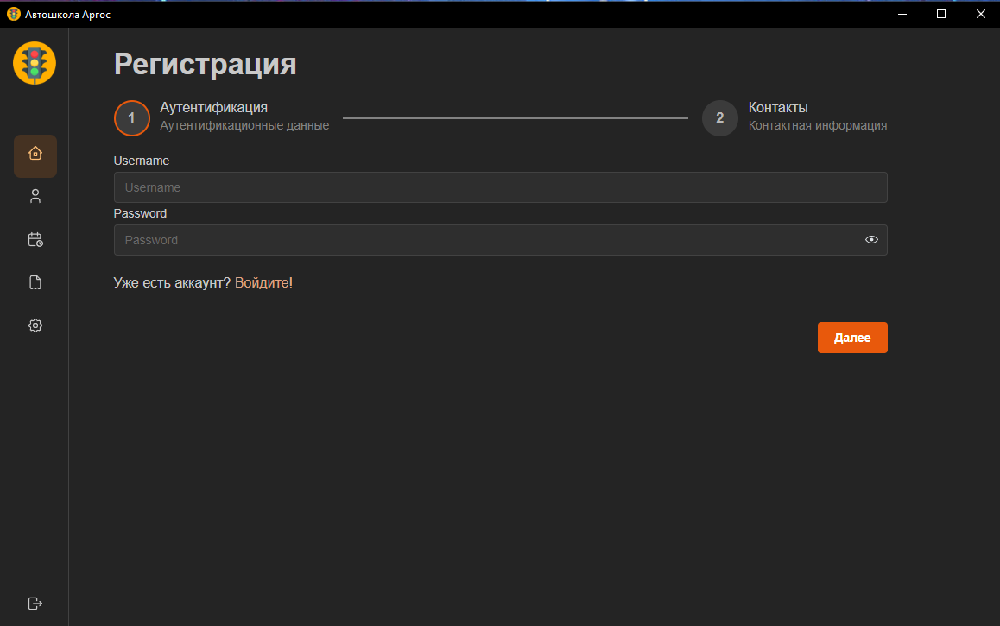
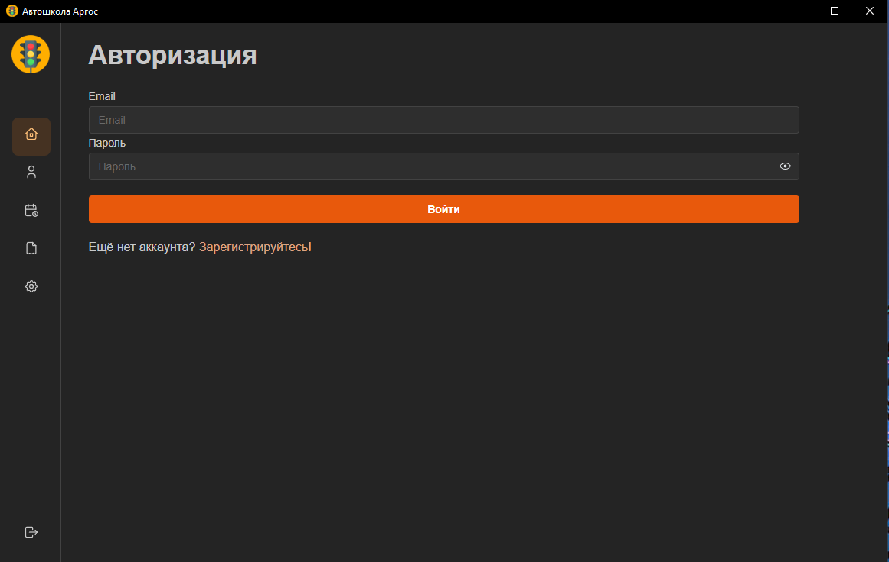
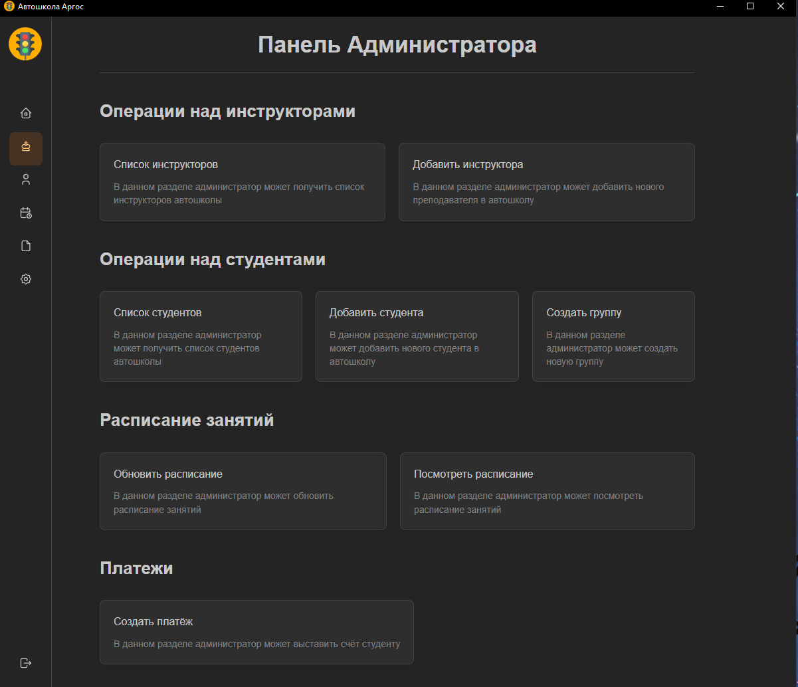
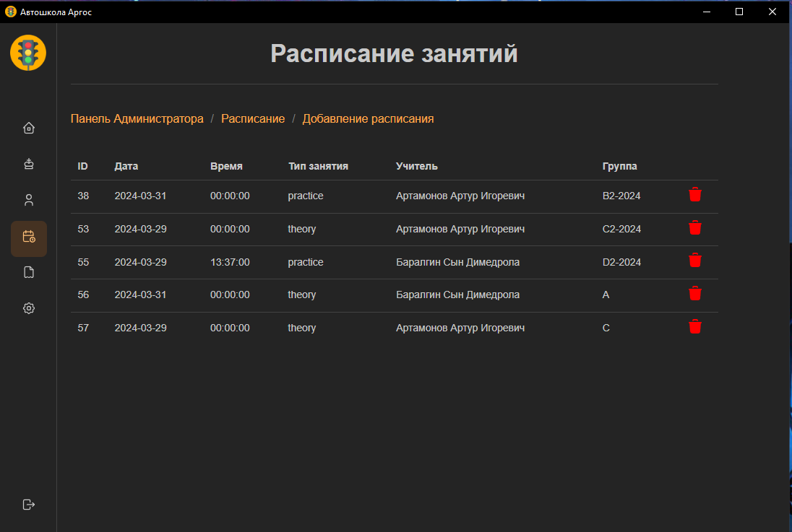
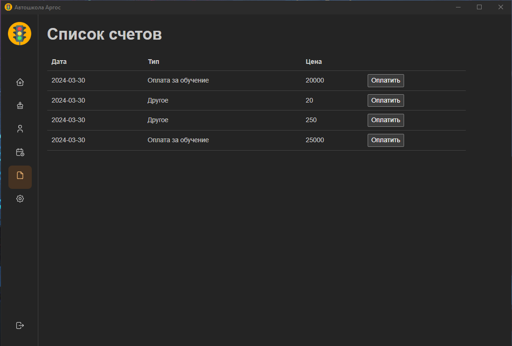

# Argos Driving School

### Stack: Tauri Rust + React + TypeScript + Vite

### Главная страница


### Регистрация


### Авторизация


### Личный кабинет


### Панель администратора


### Расписание


### Платежи


## Dependencies

### Back-end dependencies
```bash
[dependencies]
serde_json = "1.0"
serde = { version = "1.0", features = ["derive"] }
tauri = { version = "1.6.1", features = ["dialog-all"] }
sqlx = { version = "0.7.4", features = ["runtime-tokio-native-tls", "postgres", "time", "chrono", "json", "bigdecimal"] }
tokio = { version = "1", features = ["full"] }
dotenv = "0.15"
bcrypt = "0.15.1"
log = "0.4.21"
chrono = {version = "0.4.37", features = ["serde"] }
bigdecimal = { version = "0.3", features = ["serde"] }
```

### Front-end dependencies
```bash
  "dependencies": {
    "@emotion/css": "^11.11.2",
    "@mantine/charts": "^7.6.2",
    "@mantine/core": "^7.6.2",
    "@mantine/dates": "^7.7.1",
    "@mantine/form": "^7.6.2",
    "@mantine/hooks": "^7.6.2",
    "@mantine/modals": "^7.6.2",
    "@mantine/notifications": "^7.7.1",
    "@tabler/icons-react": "^3.1.0",
    "@tauri-apps/api": "^1.5.3",
    "dayjs": "^1.11.10",
    "react": "^18.2.0",
    "react-dom": "^18.2.0",
    "react-router-dom": "6",
    "recharts": "2",
    "tauri-plugin-store-api": "https://github.com/tauri-apps/tauri-plugin-store#v1",
    "zustand": "^4.5.2"
  },
  "devDependencies": {
    "@mantinex/mantine-logo": "^1.0.1",
    "@tauri-apps/cli": "^1.5.11",
    "@types/node": "^20.11.30",
    "@types/react": "^18.2.66",
    "@types/react-dom": "^18.2.22",
    "@typescript-eslint/eslint-plugin": "^7.2.0",
    "@typescript-eslint/parser": "^7.2.0",
    "@vitejs/plugin-react": "^4.2.1",
    "cross-env": "^7.0.3",
    "eslint": "^8.57.0",
    "eslint-plugin-react-hooks": "^4.6.0",
    "eslint-plugin-react-refresh": "^0.4.6",
    "mini-css-extract-plugin": "^2.8.1",
    "postcss": "^8.4.38",
    "postcss-preset-mantine": "^1.13.0",
    "postcss-simple-vars": "^7.0.1",
    "sas": "^3.0.4",
    "sass": "^1.72.0",
    "typescript": "^5.2.2",
    "vite": "^5.2.6"
  },
```

## App Tree

```
.
├── Makefile
├── README.md
├── dist
│   ├── assets
│   │   ├── NotFound-C_96Vlk8.svg
│   │   ├── index-BOFJEjfj.css
│   │   └── index-C3KddFsi.js
│   ├── index.html
│   └── vite.svg
├── index.html
├── ll.txt
├── migrations
│   ├── 001_create_tables.sql
│   └── 002_create_tables.sql
├── package.json
├── postcss.config.cjs
├── public
│   └── vite.svg
├── src
│   ├── Components
│   │   ├── Account
│   │   │   └── Account.tsx
│   │   ├── Admin
│   │   │   ├── AddGroupForm
│   │   │   │   └── AddGroupForm.tsx
│   │   │   ├── Panel
│   │   │   │   └── Panel.tsx
│   │   │   ├── Students
│   │   │   │   ├── AddStudent
│   │   │   │   │   └── AddStudent.tsx
│   │   │   │   ├── Payments
│   │   │   │   │   ├── AddPayment
│   │   │   │   │   │   └── AddPayment.tsx
│   │   │   │   │   └── PaymentsList
│   │   │   │   │       └── PaymentsList.tsx
│   │   │   │   ├── StudentDetails
│   │   │   │   │   └── StudentDetails.tsx
│   │   │   │   └── StudentsList
│   │   │   │       └── StudentsList.tsx
│   │   │   ├── Teachers
│   │   │   │   ├── AddTeacherForm
│   │   │   │   │   └── AddTeacherForm.tsx
│   │   │   │   ├── TeacherDetails
│   │   │   │   │   └── TeacherDetails.tsx
│   │   │   │   └── TeachersList
│   │   │   │       └── TeachersList.tsx
│   │   │   └── Timetable
│   │   │       ├── AddTimetableEntryForm
│   │   │       │   └── AddTimetableEntryForm.tsx
│   │   │       └── TimetableViewer
│   │   │           └── TimetableViewer.tsx
│   │   ├── App
│   │   │   ├── App.tsx
│   │   │   ├── Routing
│   │   │   │   ├── Providers
│   │   │   │   │   ├── AuthGuard.tsx
│   │   │   │   │   └── types
│   │   │   │   │       └── Paths.ts
│   │   │   │   └── Routing.tsx
│   │   │   └── Styles
│   │   │       └── Styles.scss
│   │   ├── Auth
│   │   │   ├── StudentLoginForm
│   │   │   │   └── StudentLoginForm.tsx
│   │   │   └── StudentRegistration
│   │   │       └── StudentRegistrationForm.tsx
│   │   ├── Example.tsx
│   │   ├── Home
│   │   │   └── Home.tsx
│   │   ├── Layouts
│   │   │   └── Layout.tsx
│   │   ├── Shared
│   │   │   ├── AdminCard
│   │   │   │   └── AdminCard.tsx
│   │   │   └── Link
│   │   │       ├── Link.scss
│   │   │       └── Link.tsx
│   │   ├── Sidebar
│   │   │   ├── BarItems.ts
│   │   │   ├── NavbarLink.tsx
│   │   │   ├── SideBar.module.scss
│   │   │   └── SideBar.tsx
│   │   ├── TimeTable
│   │   │   └── TimeTable.tsx
│   │   └── index.ts
│   ├── Pages
│   │   ├── Auth
│   │   │   ├── LoginPage.tsx
│   │   │   └── RegisterPage.tsx
│   │   ├── ErrorPages
│   │   │   └── NotFound
│   │   │       ├── NotFound.module.scss
│   │   │       └── NotFound.tsx
│   │   └── index.ts
│   ├── Store
│   │   ├── authStore.ts
│   │   ├── index.ts
│   │   └── sidebarStore.ts
│   ├── _mantine.scss
│   ├── assets
│   │   ├── NotFound.svg
│   │   ├── argos_logo.png
│   │   ├── ash.png
│   │   ├── little_yoda_meditation.png
│   │   ├── master.png
│   │   ├── mh.png
│   │   └── react.svg
│   ├── main.tsx
│   └── vite-env.d.ts
└── src-tauri
    ├── Cargo.lock
    ├── Cargo.toml
    ├── build.rs
    ├── icons
    │   ├── 32x32.png
    │   ├── argos_logo.icns
    │   ├── argos_logo.ico
    │   └── argos_logo.png
    └── src
       ├── admin
       │   ├── admin.rs
       │   └── mod.rs
       ├── auth
       │   ├── auth.rs
       │   └── mod.rs
       ├── database
       │   ├── create_admins.rs
       │   ├── create_tables.rs
       │   └── mod.rs
       ├── main.rs
       └── user
        ├── mod.rs
        └── user.rs
```